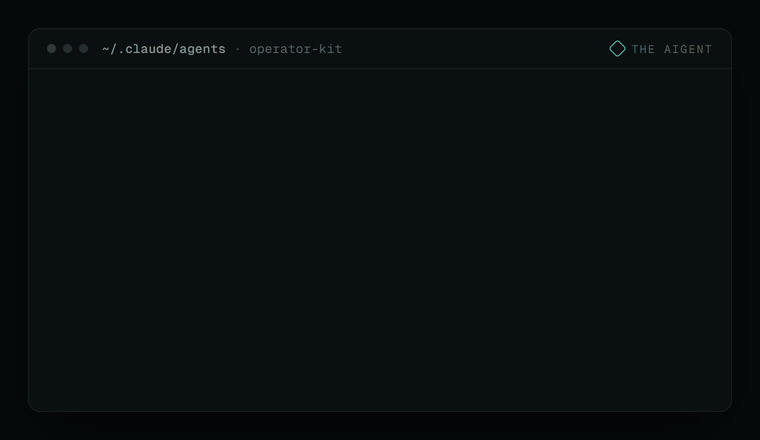

<div align="center">



# AIgent Operator Kit

**Five specialists. One install. Drop them into `~/.claude/agents/`.**

Five Claude Code subagents that each do one job well (design, build, scout, research, critique), plus a context-loader hook that stops you re-explaining your project every session. MIT licensed. Use them as-is or adapt them.

</div>

## Install

One line. Backs up your `settings.json`, installs the agents, and wires the context-loader hook (idempotent, never clobbers existing hooks):

```bash
curl -fsSL https://raw.githubusercontent.com/wrg32786/operator-kit/main/install.sh | bash
```

Prefer to do it by hand? Just copy the agents:

```bash
cp agents/*.md ~/.claude/agents/
```

Claude Code auto-discovers agents in that directory. Restart it, then invoke one:

```
use the echo agent to find every place we call the Stripe API
```

## The agents

One agent per job beats one generalist at average quality. Compose them: Echo finds the files, Newton researches the approach, Hypatia challenges it, Lyra builds it.

| Agent | Role | Example task |
|---|---|---|
| **Iris** | Visual designer (specs, not code) | "Iris, design the dashboard empty-state: palette, hierarchy, motion." |
| **Lyra** | Builder (bounded diffs) | "Lyra, add optimistic updates to the comment box. Return a diff." |
| **Echo** | Scout (read-only, fast) | "Echo, list every route handler under `src/api/`." |
| **Newton** | Research synthesist (cited) | "Newton, Drizzle vs Prisma for our schema, with sources." |
| **Hypatia** | Critic (devil's advocate) | "Hypatia, poke holes in this migration plan before I run it." |

Two patterns worth calling out. **Lyra and Newton end every response with an honesty ledger**: what changed, what was left alone, what was noticed but not fixed, what is still uncertain. You stay informed even when you are moving fast. **Iris writes specs, not code**: a brief precise enough that a builder implements without guessing.

## The context loader

A `UserPromptSubmit` hook. Mention a keyword you have configured ("auth flow", "payments") and the relevant project files are injected into context before the agent responds. Structural enforcement, not a memory note: it fires every time, not just when you remember to.

```jsonc
// project-keywords.json
"auth": {
  "keywords": ["auth flow", "login", "session"],
  "priority_file": "docs/auth.md",
  "files": ["docs/auth.md", "src/lib/session.ts"]
}
```

The installer drops a starter keywords file at `~/.claude/hooks/operator-kit-keywords.json`. Point its entries at your files, restart, and type a keyword to see the `[AUTO-CONTEXT]` block appear. Full walkthrough in [`context-loader/install.md`](context-loader/install.md).

## The critical-rules template

`rules/post-compact-critical.md.template` is a starting point for rules that must survive a long session. When Claude Code compacts, most history is lost; files wired into your project settings do not. Capture the things that cannot drift: database invariants, style rules, known footguns, verification gates.

## What's in it

```
operator-kit/
├── agents/          # iris · lyra · echo · newton · hypatia  → ~/.claude/agents/
├── context-loader/  # auto-context-load.sh + keywords + install guide
├── rules/           # post-compact rules template
├── examples/        # a filled-out keywords file
└── install.sh       # one-click installer
```

## License

MIT. See [LICENSE](LICENSE). The agents are self-contained: no private skills, no hidden dependencies, nothing to phone home.

---

<div align="center">

Built by **[The AIgent](https://theaigent.xyz)**. A weekly digest on running Claude Code at scale: **[theaigent.xyz](https://theaigent.xyz)**

Want the full operator system these agents run inside? **[aigent-OS](https://theaigent.gumroad.com/l/aigent-os)** ($197).

</div>
