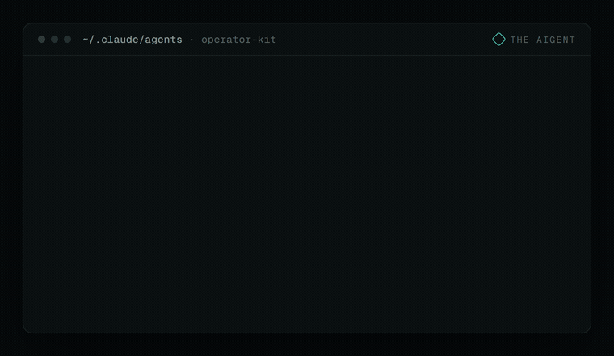

<div align="center">


# AIgent Operator Kit

**Five focused Claude Code specialists. One small install.**

Echo maps, Newton researches, Hypatia challenges, Iris specifies, and Lyra builds. The optional context-loader hook adds a relevant file map and priority excerpt when your prompt mentions a configured project topic.

MIT licensed. The five agents are plain Markdown; the optional hook uses Bash and Python 3.8+.

</div>

## Install

### Recommended: Claude Code plugin

```text
/plugin marketplace add wrg32786/operator-kit
/plugin install operator-kit@operator-kit
```

Plugin agents are namespaced, for example `operator-kit:echo`. Use the plugin or the legacy installer, not both. After installation, start a new session or run `/reload-plugins`, then invoke one naturally or by name:

```text
use operator-kit:echo to find every place we call the Stripe API
```

### Legacy user-scope install

```bash
curl -fsSL https://raw.githubusercontent.com/wrg32786/operator-kit/main/install.sh | bash
```

The legacy installer places unscoped agents under `~/.claude/agents/operator-kit/`, preserves existing configuration, backs up customized agent files before replacing them, and wires the optional hook only when Python 3.8+ is available.

Manual agents-only install from a local clone:

```bash
mkdir -p ~/.claude/agents/operator-kit
cp agents/*.md ~/.claude/agents/operator-kit/
```

## How routing works

You do not need to memorize the roster. Claude Code matches your request and current context against each agent's `description`, then delegates when a specialist is a good fit. Operator Kit descriptions explicitly say **use proactively** for their clear trigger cases.

Automatic delegation is best-effort, not a hard router:

- **Ask naturally** — Claude usually chooses the matching specialist.
- **Name the agent** — a strong hint, such as “use Echo to trace the callers.”
- **Type `@` and select the agent** — guarantees that specialist runs for the task.

Each agent also carries the display color used by its character identity: cyan Echo, blue Newton, red Hypatia, purple Iris, and green Lyra.

## Use the smallest team that works

**Use one specialist by default. Compose only when the task crosses roles.**

| Need | Use |
|---|---|
| Locate code or trace callers | **Echo** |
| Implement a clear, bounded change | **Lyra** |
| Repair an unclear bug | **Echo → Lyra** |
| Evaluate a current tool or approach | **Newton → Hypatia** |
| Design and build a visual surface | **Iris → Lyra** |
| Review the current diff | Claude Code's built-in **`/code-review`** |
| Commit, push, open a PR, or merge | **Main session, only when explicitly requested** |

## Meet the agents

The roster gives each specialist a distinct visual identity while the actual behavior stays in the plain Markdown agent files.

| Agent | Visual identity | Job | Example task |
|---|---|---|---|
| **[Echo](agents/echo.md)** | Cyan scout | Read-only codebase reconnaissance | “Echo, trace every caller of `createInvoice` and return paths and lines.” |
| **[Newton](agents/newton.md)** | Navy-and-gold researcher | Current, cited research synthesis | “Newton, compare Drizzle and Prisma for this schema using primary sources.” |
| **[Hypatia](agents/hypatia.md)** | Plum-and-crimson critic | Adversarial decision review | “Hypatia, find the strongest reason not to run this migration.” |
| **[Iris](agents/iris.md)** | Violet-and-white designer | Visual specification | “Iris, specify the dashboard empty state: hierarchy, type, spacing, and motion.” |
| **[Lyra](agents/lyra.md)** | Green-and-steel builder | Bounded implementation | “Lyra, implement this accepted spec and run the smallest relevant check.” |

The boundaries are enforced in frontmatter, not just prose. Echo, Hypatia, and Iris receive only read tools. Newton receives read and web-research tools. Lyra alone receives write and shell tools.

<details>
<summary><strong>See the original terminal handoff animation</strong></summary>
<br>
<p align="center"></p>
</details>

## Review and publish

Focused analysis and implementation can route to agents. Repository side effects remain with the main Claude Code session:

1. **Implement:** Lyra edits and verifies the working tree.
2. **Review:** run the built-in `/code-review` when you want a deliberate diff review. It is manual by design so a longer review does not spend time and tokens unexpectedly.
3. **Publish:** explicitly ask the main session to commit, push, or open a pull request.
4. **Merge:** explicitly approve the merge, or use GitHub auto-merge after required checks pass.

No Operator Kit agent silently commits, pushes, opens a pull request, enables auto-merge, or merges.

## Context loader

The plugin includes a silent `UserPromptSubmit` hook. It does nothing until you add a keywords file to your project.

```bash
mkdir -p .claude
curl -fsSL \
  https://raw.githubusercontent.com/wrg32786/operator-kit/main/examples/sample-project-keywords.json \
  -o .claude/operator-kit-keywords.json
```

Then replace the sample paths with paths from your project:

```json
{
  "auth": {
    "keywords": ["authentication", "auth flow", "login", "session"],
    "priority_file": "docs/auth.md",
    "files": [
      "docs/auth.md",
      "src/lib/session.ts"
    ]
  }
}
```

When a submitted prompt contains one of those whole words or phrases, the hook adds:

- The first 40 lines of `priority_file`.
- A map of the configured project paths.
- An instruction to read the relevant paths before making claims or changes.

It matches only the submitted `prompt`, rejects paths outside the project root, writes nothing into the project, and keeps debug logging off by default.

> **Privacy:** the priority excerpt becomes part of the active Claude session. Do not configure secrets, credentials, private keys, `.env` files, or any file you would not intentionally send to your configured Claude provider.

Full configuration and troubleshooting: [`context-loader/install.md`](context-loader/install.md).

## Critical rules

`rules/post-compact-critical.md.template` is a starter for invariants that must survive long sessions and context compaction.

```bash
mkdir -p .claude/rules
curl -fsSL \
  https://raw.githubusercontent.com/wrg32786/operator-kit/main/rules/post-compact-critical.md.template \
  -o .claude/rules/critical.md
```

Use it for production/test boundaries, architectural invariants, known footguns, and required verification—not general documentation.

## Platform support

The five agents are platform-independent Markdown. The optional context loader requires `bash` and Python 3.8+.

| Environment | Agents | Context loader |
|---|---:|---:|
| Linux | Yes | CI-verified |
| macOS | Yes | Supported; Bash + Python required |
| WSL | Yes | Supported; Bash + Python required |
| Native Windows with Git Bash | Yes | Supported when `bash` and Python are on `PATH`; not yet CI-verified |
| Native Windows without Bash | Yes | No |

## Uninstall

Plugin install:

```bash
claude plugin uninstall operator-kit@operator-kit
claude plugin marketplace remove operator-kit
```

Legacy install:

```bash
rm -rf ~/.claude/agents/operator-kit ~/.claude/hooks/operator-kit
rm -f ~/.claude/operator-kit-keywords.json
```

Then remove the `UserPromptSubmit` entry that references `~/.claude/hooks/operator-kit/auto-context-load.sh` from `~/.claude/settings.json`.

## Repository

```text
operator-kit/
├── .claude-plugin/  # plugin manifest + marketplace catalog
├── agents/          # echo · hypatia · iris · lyra · newton
├── assets/agents/   # visual roster for the five specialists
├── context-loader/  # hook wrapper, standard-library loader, guide, starter config
├── examples/        # filled-out project keywords example
├── hooks/           # native plugin hook registration
├── rules/           # critical project-rules template
├── tests/           # dependency-free regression check
└── install.sh       # legacy user-scope installer
```

## Validate

```bash
python3 tests/smoke.py
claude plugin validate .
```

CI also installs the actual Claude Code CLI into a clean configuration directory, adds this repository as a local marketplace, installs the plugin, verifies its agent and hook inventory, executes the installed context loader, and uninstalls it.

See [`CHANGELOG.md`](CHANGELOG.md) for release notes.

## License

MIT. See [LICENSE](LICENSE). The five agents are self-contained; the optional context loader uses only Python’s standard library.

---

<div align="center">

Built by **[The AIgent](https://theaigent.xyz)**. A weekly digest on running Claude Code at scale: **[theaigent.xyz](https://theaigent.xyz)**

Want the full operator system these agents run inside? **[aigent-OS](https://github.com/wrg32786/aigent-os)** — free and open source (MIT).

</div>
